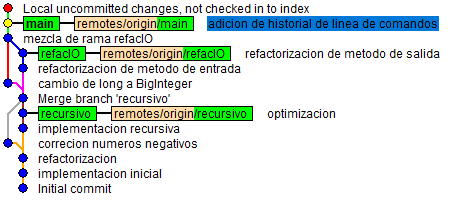

# Introduction 

Git / GitHub first approach by simulating a real working enviroment where a single person develops a software for the implementation of an algorithm which calculates a factorial. The continuation of this proyect is another example where several developers work together in order to implement a very common OOP code. It can be checked in the following [link](https://github.com/MarioPasc/git-grupal).

# About the proyect

There are different branches that the proyect is divided into:
* __main__: loop classic implementation of the factorial.
* __recursivo__: recursive version of the algorithm.
* __refacIO__: code refactoring of the Input/Output so that the functions are not included in the main method.

A final visualization of the repository using **gitk** would look like:

  

  
  

# Practiced skills

* Projects and directories **management** from the windows terminal.
* GitHub and remote repositories essentials.
* Git usage and local-remote repository linking:
  * __Local commands__: git add, git commit, git merge, git branch...
  * __Remote connection__: git pull, git push.
* Visual interface interpretation (**gitk**).
